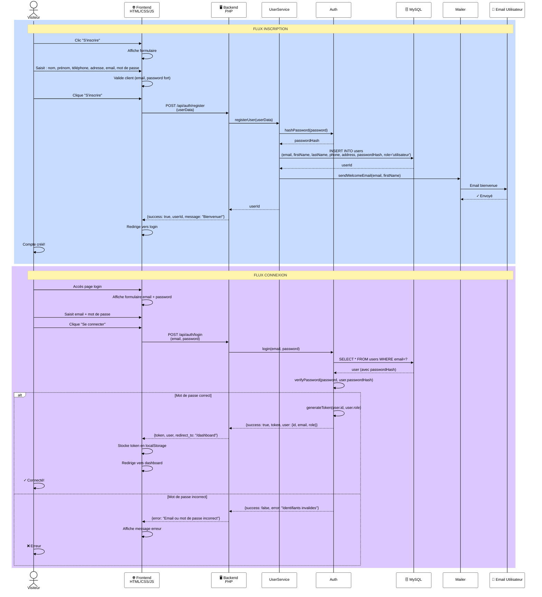

# Diagramme de Séquence 1 : Inscription & Connexion

## 📋 Description

Flux complet d'inscription d'un visiteur et connexion au système.

---

## Diagramme

---

## 📊 Détails du Flux

### **Flux Inscription**

| Étape | Acteur | Action |
|-------|--------|--------|
| 1 | Visiteur | Clic "S'inscrire" |
| 2 | Frontend | Affiche formulaire |
| 3 | Visiteur | Saisit données |
| 4 | Frontend | Valide données côté client |
| 5 | Visiteur | Clique "S'inscrire" |
| 6 | Frontend | POST /api/auth/register |
| 7 | Backend | Appelle UserService |
| 8 | UserService | Hash password + Crée user |
| 9 | Database | INSERT user |
| 10 | Mailer | Envoie email bienvenue |
| 11 | Visiteur | Reçoit email + Compte créé |

### **Flux Connexion**

| Étape | Acteur | Action |
|-------|--------|--------|
| 1 | Visiteur | Accès page login |
| 2 | Frontend | Affiche formulaire |
| 3 | Visiteur | Saisit email + password |
| 4 | Visiteur | Clique "Se connecter" |
| 5 | Frontend | POST /api/auth/login |
| 6 | Backend | Appelle Auth |
| 7 | Auth | Récupère user + Verify password |
| 8 | Auth | Génère JWT token |
| 9 | Frontend | Stocke token + Redirige |
| 10 | Visiteur | Connecté ! |

---

## 🔐 Sécurité

✅ **Validation côté client** (email, password fort)  
✅ **Hash password** (bcrypt via Auth::hashPassword)  
✅ **JWT token** pour authentification stateless  
✅ **Stockage localStorage** du token  
✅ **Validation côté serveur** de tous les inputs

---

## 🔗 Classes Impliquées

- **User** : Gère les données utilisateurs
- **UserService** : Logique d'inscription
- **Auth** : Hash + JWT
- **Mailer** : Notifications email
- **MySQLDatabase** : Persistance données
