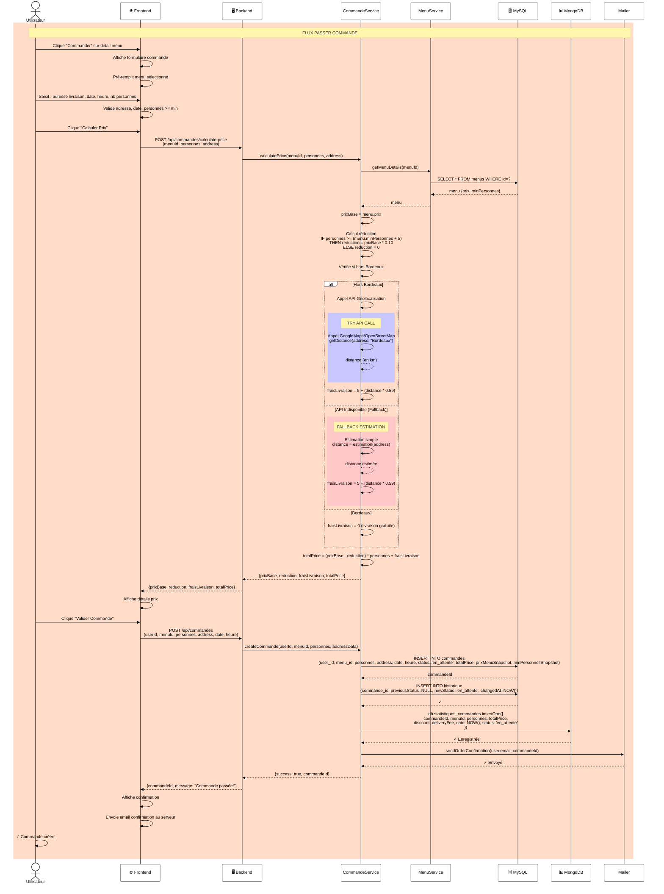

# Diagramme de Séquence 2 : Passer une Commande

## 📋 Description

Flux complet de passage de commande : calcul prix, réductions, frais livraison, historisation et notification.

---

## Diagramme



---

## 📊 Détails du Flux

### **Calcul du Prix**

| Règle | Détail |
|-------|--------|
| **Réduction 10%** | IF personnes ≥ (minPersonnes + 5) THEN réduction = prixBase × 0.10 |
| **Frais Livraison** | IF Bordeaux THEN 0€<br/>ELSE 5€ + (distance_km × 0,59€/km)<br/>distance obtenue via API Géolocalisation (Google Maps/OpenStreetMap) avec fallback sur estimation simple si API indisponible |
| **Prix Total** | (prixBase - réduction) × personnes + fraisLivraison |

### **Flux d'Exécution**

| Étape | Système | Action |
|-------|---------|--------|
| 1-3 | Frontend | Affiche formulaire + Saisie |
| 4-6 | Frontend + Backend | Validation + Calcul prix |
| 7-11 | CommandeService | Calculs réductions et frais |
| 12-13 | Frontend + Utilisateur | Affiche prix + Confirmation |
| 14-16 | CommandeService | INSERT commande + historique |
| 17-18 | CommandeService | Sync MongoDB statistiques |
| 19 | Mailer | Envoie confirmation |
| 20 | Utilisateur | Reçoit email |

---

## 💾 Données Sauvegardées

### **MySQL (COMMANDES table)**

```sql
INSERT INTO commandes (
  user_id, menu_id, personnes, 
  address, date, heure,
  status, totalPrice,
  prixMenuSnapshot, minPersonnesSnapshot
)
```

### **MongoDB (statistiques_commandes)**

```javascript
db.statistiques_commandes.insertOne({
  commandeId, menuId, personnes,
  totalPrice, discount, deliveryFee,
  date: NOW(), status: 'en_attente'
})
```

### **MySQL (HISTORIQUE table)**

```sql
INSERT INTO historique (
  commande_id, previousStatus, newStatus,
  changedAt
)
VALUES (commandeId, NULL, 'en_attente', NOW())
```

---

## 🔐 Sécurité

✅ **Validation input** : adresse, date, nombre personnes  
✅ **Snapshot pricing** : prix du menu gelé pour immuabilité  
✅ **Historisation** : traçabilité complète  
✅ **Dual DB** : MySQL + MongoDB pour redondance  
✅ **Email confirmation** : notification utilisateur  
✅ **API Géolocalisation** : Clé API stockée en variables d'environnement (`.env`), jamais exposée côté client  
✅ **Fallback robuste** : Si API indisponible → estimation simple, commande ne bloque pas

### **Configuration API Géolocalisation**

```php
// .env (ne pas committer)
GOOGLE_MAPS_API_KEY=xxxxxx
GEOLOCATION_API_TIMEOUT=5000  // ms

// Code Backend
try {
    $distance = GeoLocationService::getDistance(
        $address, 
        'Bordeaux',
        env('GOOGLE_MAPS_API_KEY')
    );
} catch (ApiTimeoutException | ApiException $e) {
    // FALLBACK : estimation simple
    $distance = GeoLocationService::estimateDistance($address);
    $this->logger->warning("Géolocalisation API failed, using estimation", ['address' => $address]);
}
```

---

## 🔗 Classes Impliquées

- **Menu** : Récupère détails menu
- **MenuService** : Logique menu
- **Commande** : Crée/gère commande
- **CommandeService** : Logique métier commande
- **Historique** : Trace changements
- **Mailer** : Notifications
- **MySQLDatabase** : Persistance MySQL
- **MongoDBClient** : Analytics MongoDB
