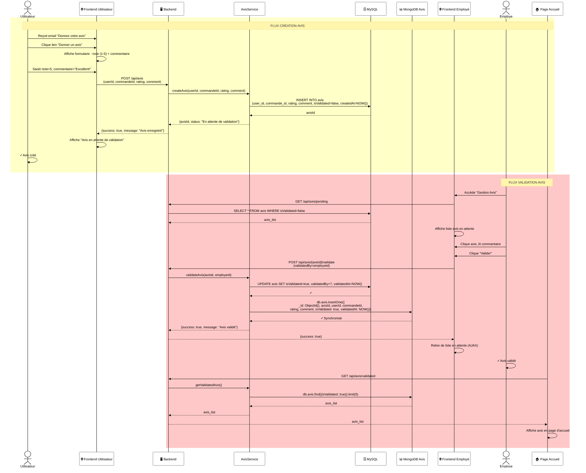

# Diagramme de Séquence 4 : Validation d'Avis (Employé)

## 📋 Description

Flux complet de validation d'avis : création par utilisateur, modération par employé, synchronisation MongoDB et affichage page accueil.

---

## Diagramme



---

## 📊 Détails du Flux

### **Phase 1 : Création d'Avis**

| Étape | Acteur | Action |
|-------|--------|--------|
| 1 | Utilisateur | Reçoit email notification |
| 2-3 | Utilisateur | Clique lien + Formulaire |
| 4-5 | Utilisateur | Saisit note + commentaire |
| 6-7 | Frontend | POST /api/avis |
| 8-9 | Backend | Appelle AvisService |
| 10 | AvisService | INSERT avis (isValidated=false) |
| 11 | Utilisateur | Reçoit confirmation |

### **Phase 2 : Validation par Employé**

| Étape | Acteur | Action |
|-------|--------|--------|
| 1-3 | Employé | Accès + Liste avis en attente |
| 4 | Employé | Lit avis |
| 5-6 | Employé | Clique "Valider" |
| 7-9 | Backend | Appelle AvisService |
| 10 | AvisService | UPDATE avis (isValidated=true) |
| 11 | AvisService | INSERT MongoDB avis validé |
| 12 | Frontend | Retire de liste |

### **Phase 3 : Affichage Page Accueil**

| Étape | Système | Action |
|-------|---------|--------|
| 1-2 | Frontend Accueil | GET /api/avis/validated |
| 3-5 | Backend | Récupère depuis MongoDB |
| 6-7 | Frontend | Affiche avis récents validés |

---

## 💾 Données Sauvegardées

### **MySQL (AVIS table) - Avant validation**

```sql
INSERT INTO avis (
  user_id, commande_id, rating, comment,
  isValidated, createdAt
)
VALUES (userId, commandeId, 5, 'Excellent!', false, NOW())
```

### **MySQL (AVIS table) - Après validation**

```sql
UPDATE avis 
SET isValidated=true, validatedBy=employeId, validatedAt=NOW()
WHERE id=avisId
```

### **MongoDB (avis collection) - Avis validés uniquement**

```javascript
db.avis.insertOne({
  _id: ObjectId(),
  avisId, userId, commandeId,
  rating: 5, comment: 'Excellent!',
  isValidated: true,
  validatedAt: ISODate(NOW)
})
```

---

## 🎯 Règles de Gestion

- ✅ Avis créé avec statut "En attente"
- ✅ Employé doit valider avant publication
- ✅ Seuls avis validés apparaissent en accueil
- ✅ Sync MySQL ↔ MongoDB pour avis validés
- ✅ Fallback table AVIS_FALLBACK en cas de panne MongoDB

---

## 🔐 Sécurité

✅ **Modération** : Avis validés uniquement par employé  
✅ **Validation input** : Rating 1-5, commentaire sanitisé  
✅ **Authentification** : Utilisateur connecté requis  
✅ **Duplication DB** : MySQL + MongoDB pour redondance  
✅ **Audit trail** : Trace validatedBy + validatedAt

---

## 🔗 Classes Impliquées

- **Avis** : Crée/récupère avis
- **AvisService** : Logique métier avis
- **Mailer** : Notification création avis
- **MySQLDatabase** : Persistance MySQL
- **MongoDBClient** : Synchronisation analytics
