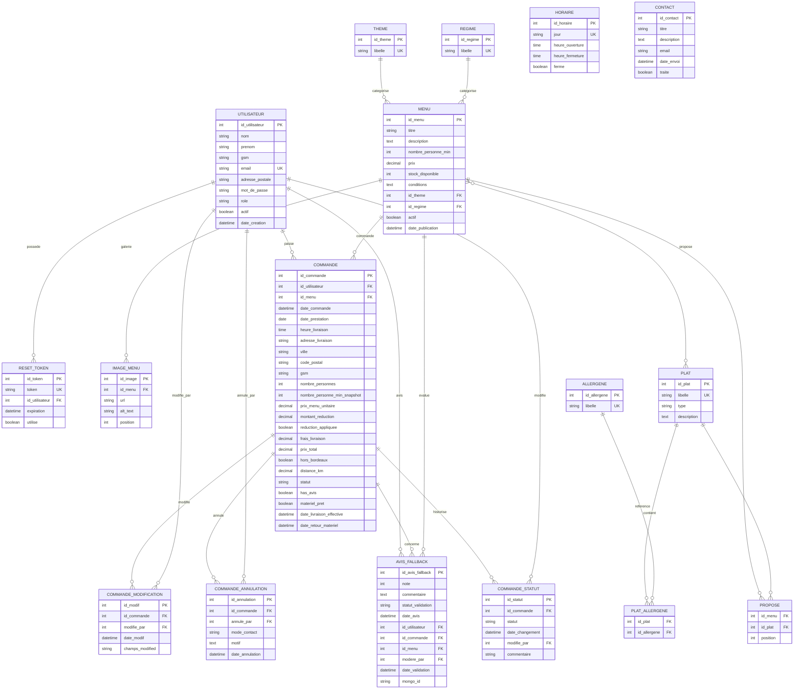

```mermaid
erDiagram
    UTILISATEUR {
        int id_utilisateur PK
        string nom
        string prenom
        string gsm
        string email UK
        string adresse_postale
        string mot_de_passe
        string role
        boolean actif
        datetime date_creation
    }
    RESET_TOKEN {
        int id_token PK
        string token UK
        int id_utilisateur FK
        datetime expiration
        boolean utilise
    }
    THEME {
        int id_theme PK
        string libelle UK
    }
    REGIME {
        int id_regime PK
        string libelle UK
    }
    MENU {
        int id_menu PK
        string titre
        text description
        int nombre_personne_min
        decimal prix
        int stock_disponible
        text conditions
        int id_theme FK
        int id_regime FK
        boolean actif
        datetime date_publication
    }
    IMAGE_MENU {
        int id_image PK
        int id_menu FK
        string url
        string alt_text
        int position
    }
    PLAT {
        int id_plat PK
        string libelle UK
        string type
        text description
    }
    PROPOSE {
        int id_menu FK
        int id_plat FK
        int position
    }
    ALLERGENE {
        int id_allergene PK
        string libelle UK
    }
    PLAT_ALLERGENE {
        int id_plat FK
        int id_allergene FK
    }
    HORAIRE {
        int id_horaire PK
        string jour UK
        time heure_ouverture
        time heure_fermeture
        boolean ferme
    }
    CONTACT {
        int id_contact PK
        string titre
        text description
        string email
        datetime date_envoi
        boolean traite
    }
    COMMANDE {
        int id_commande PK
        int id_utilisateur FK
        int id_menu FK
        datetime date_commande
        date date_prestation
        time heure_livraison
        string adresse_livraison
        string ville
        string code_postal
        string gsm
        int nombre_personnes
        int nombre_personne_min_snapshot
        decimal prix_menu_unitaire
        decimal montant_reduction
        boolean reduction_appliquee
        decimal frais_livraison
        decimal prix_total
        boolean hors_bordeaux
        decimal distance_km
        string statut
        boolean has_avis
        boolean materiel_pret
        datetime date_livraison_effective
        datetime date_retour_materiel
    }
    COMMANDE_STATUT {
        int id_statut PK
        int id_commande FK
        string statut
        datetime date_changement
        int modifie_par FK
        string commentaire
    }
    COMMANDE_ANNULATION {
        int id_annulation PK
        int id_commande FK
        int annule_par FK
        string mode_contact
        text motif
        datetime date_annulation
    }
    COMMANDE_MODIFICATION {
        int id_modif PK
        int id_commande FK
        int modifie_par FK
        datetime date_modif
        string champs_modified
    }
    AVIS_FALLBACK {
        int id_avis_fallback PK
        int note
        text commentaire
        string statut_validation
        datetime date_avis
        int id_utilisateur FK
        int id_commande FK
        int id_menu FK
        int modere_par FK
        datetime date_validation
        string mongo_id
    }

    UTILISATEUR ||--o{ RESET_TOKEN : "possede"
    THEME ||--o{ MENU : "categorise"
    REGIME ||--o{ MENU : "categorise"
    MENU ||--o{ IMAGE_MENU : "galerie"
    MENU }o--o{ PLAT : "propose"
    MENU ||--o{ PROPOSE : ""
    PLAT ||--o{ PROPOSE : ""
    PLAT ||--o{ PLAT_ALLERGENE : "contient"
    ALLERGENE ||--o{ PLAT_ALLERGENE : "reference"
    UTILISATEUR ||--o{ COMMANDE : "passe"
    MENU ||--o{ COMMANDE : "commande"
    COMMANDE ||--o{ COMMANDE_STATUT : "historise"
    UTILISATEUR ||--o{ COMMANDE_STATUT : "modifie"
    COMMANDE ||--o{ COMMANDE_ANNULATION : "annule"
    UTILISATEUR ||--o{ COMMANDE_ANNULATION : "annule_par"
    COMMANDE ||--o{ COMMANDE_MODIFICATION : "modifie"
    UTILISATEUR ||--o{ COMMANDE_MODIFICATION : "modifie_par"
    UTILISATEUR ||--o{ AVIS_FALLBACK : "avis"
    COMMANDE ||--o{ AVIS_FALLBACK : "concerne"
    MENU ||--o{ AVIS_FALLBACK : "evalue"
```
