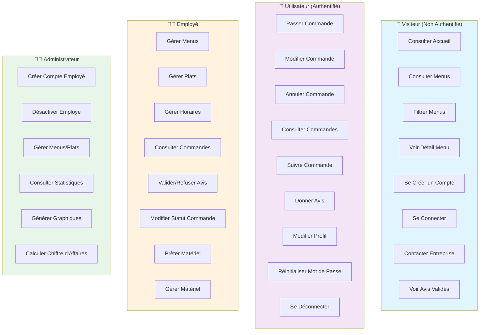

# Diagramme de Cas d'Utilisation - Vite & Gourmand

## 📊 Vue Globale des Acteurs et Use Cases

---

## 📋 Diagramme de Cas d'Utilisation Détaillé

```mermaid
graph LR
    Visiteur["🔓 Visiteur"]
    Utilisateur["🔐 Utilisateur"]
    Employe["👨‍💼 Employé"]
    Admin["👨‍💻 Admin"]
    Systeme["🖥️ Système Vite & Gourmand"]
    
    subgraph Authentification["🔐 Authentification"]
        UC_Register["Créer un Compte"]
        UC_Login["Se Connecter"]
        UC_Logout["Se Déconnecter"]
        UC_ResetPwd["Réinitialiser Mot de Passe"]
        UC_UpdateProfile["Modifier Profil"]
    end
    
    subgraph Consultation["📖 Consultation Menus & Accueil"]
        UC_ConsultAccueil["Consulter Page Accueil"]
        UC_ConsultMenus["Consulter Liste Menus"]
        UC_FilterMenus["Filtrer Menus"]
        UC_DetailMenu["Voir Détail Menu"]
        UC_ViewAvis["Voir Avis Validés"]
    end
    
    subgraph Commande["🛒 Gestion Commandes"]
        UC_PasserCmd["Passer Commande"]
        UC_ModifyCmd["Modifier Commande"]
        UC_CancelCmd["Annuler Commande"]
        UC_ViewCmd["Consulter Commandes"]
        UC_FollowCmd["Suivre Commande"]
        UC_LoanMaterial["Emprunter Matériel"]
        UC_ReturnMaterial["Retourner Matériel"]
    end
    
    subgraph Avis["⭐ Gestion Avis"]
        UC_CreateAvis["Donner un Avis"]
        UC_ValidateAvis["Valider Avis"]
        UC_RejectAvis["Refuser Avis"]
    end
    
    subgraph MenuGestion["⚙️ Gestion Menus & Données"]
        UC_CreateMenu["Créer Menu"]
        UC_UpdateMenu["Modifier Menu"]
        UC_DeleteMenu["Supprimer Menu"]
        UC_ManageDishes["Gérer Plats"]
        UC_ManageHours["Gérer Horaires"]
        UC_ManageMaterial["Gérer Matériel"]
    end
    
    subgraph AdminGestion["🔧 Gestion Admin"]
        UC_CreateEmp["Créer Compte Employé"]
        UC_DisableEmp["Désactiver Employé"]
        UC_ViewStats["Consulter Statistiques"]
        UC_GenGraph["Générer Graphiques"]
        UC_CalcRevenue["Calculer Chiffre d'Affaires"]
    end
    
    subgraph Contact["📧 Contact"]
        UC_ContactForm["Remplir Formulaire Contact"]
        UC_SendEmail["Envoyer Email Contact"]
    end

    %% Acteurs vers Use Cases
    Visiteur -->|Voir accueil| UC_ConsultAccueil
    Visiteur -->|Parcourir| UC_ConsultMenus
    Visiteur -->|Filtrer| UC_FilterMenus
    Visiteur -->|Détail| UC_DetailMenu
    Visiteur -->|Avis validés| UC_ViewAvis
    Visiteur -->|S'inscrire| UC_Register
    Visiteur -->|Se connecter| UC_Login
    Visiteur -->|Contact| UC_ContactForm
    
    Utilisateur -->|Voir accueil| UC_ConsultAccueil
    Utilisateur -->|Consulter| UC_ConsultMenus
    Utilisateur -->|Filtrer| UC_FilterMenus
    Utilisateur -->|Détail| UC_DetailMenu
    Utilisateur -->|Avis validés| UC_ViewAvis
    Utilisateur -->|Commander| UC_PasserCmd
    Utilisateur -->|Modifier| UC_ModifyCmd
    Utilisateur -->|Annuler| UC_CancelCmd
    Utilisateur -->|Consulter| UC_ViewCmd
    Utilisateur -->|Suivre| UC_FollowCmd
    Utilisateur -->|Donner avis| UC_CreateAvis
    Utilisateur -->|Emprunter| UC_LoanMaterial
    Utilisateur -->|Retourner| UC_ReturnMaterial
    Utilisateur -->|Modifier| UC_UpdateProfile
    Utilisateur -->|Réinit pwd| UC_ResetPwd
    Utilisateur -->|Logout| UC_Logout
    
    Employe -->|Voir| UC_ConsultMenus
    Employe -->|Voir menus| UC_ViewCmd
    Employe -->|Créer menu| UC_CreateMenu
    Employe -->|Modifier menu| UC_UpdateMenu
    Employe -->|Supprimer menu| UC_DeleteMenu
    Employe -->|Gérer plats| UC_ManageDishes
    Employe -->|Gérer horaires| UC_ManageHours
    Employe -->|Gérer matériel| UC_ManageMaterial
    Employe -->|Valider avis| UC_ValidateAvis
    Employe -->|Refuser avis| UC_RejectAvis
    Employe -->|Modifier statut| UC_ModifyCmd
    Employe -->|Prêt matériel| UC_LoanMaterial
    Employe -->|Logout| UC_Logout
    
    Admin -->|Créer employé| UC_CreateEmp
    Admin -->|Désactiver| UC_DisableEmp
    Admin -->|Voir stats| UC_ViewStats
    Admin -->|Graphiques| UC_GenGraph
    Admin -->|CA| UC_CalcRevenue
    Admin -->|Toutes actions employé| Employe
    Admin -->|Logout| UC_Logout

    %% Cas d'utilisation vers Système
    UC_Register --> Systeme
    UC_Login --> Systeme
    UC_Logout --> Systeme
    UC_ResetPwd --> Systeme
    UC_UpdateProfile --> Systeme
    UC_ConsultAccueil --> Systeme
    UC_ConsultMenus --> Systeme
    UC_FilterMenus --> Systeme
    UC_DetailMenu --> Systeme
    UC_ViewAvis --> Systeme
    UC_PasserCmd --> Systeme
    UC_ModifyCmd --> Systeme
    UC_CancelCmd --> Systeme
    UC_ViewCmd --> Systeme
    UC_FollowCmd --> Systeme
    UC_CreateAvis --> Systeme
    UC_ValidateAvis --> Systeme
    UC_RejectAvis --> Systeme
    UC_CreateMenu --> Systeme
    UC_UpdateMenu --> Systeme
    UC_DeleteMenu --> Systeme
    UC_ManageDishes --> Systeme
    UC_ManageHours --> Systeme
    UC_ManageMaterial --> Systeme
    UC_LoanMaterial --> Systeme
    UC_ReturnMaterial --> Systeme
    UC_ContactForm --> Systeme
    UC_SendEmail --> Systeme
    UC_CreateEmp --> Systeme
    UC_DisableEmp --> Systeme
    UC_ViewStats --> Systeme
    UC_GenGraph --> Systeme
    UC_CalcRevenue --> Systeme

    style Visiteur fill:#e1f5ff,stroke:#01579b,stroke-width:2px
    style Utilisateur fill:#f3e5f5,stroke:#4a148c,stroke-width:2px
    style Employe fill:#fff3e0,stroke:#e65100,stroke-width:2px
    style Admin fill:#e8f5e9,stroke:#1b5e20,stroke-width:2px
    style Systeme fill:#f5f5f5,stroke:#000,stroke-width:3px
    
    style Authentification fill:#ffe0b2
    style Consultation fill:#b3e5fc
    style Commande fill:#f8bbd0
    style Avis fill:#fff9c4
    style MenuGestion fill:#c8e6c9
    style AdminGestion fill:#d1c4e9
    style Contact fill:#ffccbc
```

---

## 📑 Description des Cas d'Utilisation

### **🔐 Authentification**

#### UC_Register : Créer un Compte
| Propriété | Valeur |
|-----------|--------|
| **Acteurs** | Visiteur → Utilisateur |
| **Précondition** | Visiteur non authentifié |
| **Flux Principal** | 1. Visiteur clique "S'inscrire" 2. Saisit nom, prénom, téléphone, adresse, email, mot de passe 3. Système valide données 4. Crée compte avec rôle "Utilisateur" 5. Envoie email bienvenue |
| **Postcondition** | Compte créé, utilisateur reçoit email |
| **Exceptions** | Email déjà utilisé, password faible, données invalides |
| **Classes** | User, Auth, UserService, Mailer |

#### UC_Login : Se Connecter
| Propriété | Valeur |
|-----------|--------|
| **Acteurs** | Visiteur → Utilisateur / Employé / Admin |
| **Précondition** | Compte existant, non authentifié |
| **Flux Principal** | 1. Visiteur entre email + mot de passe 2. Système vérifie identifiants 3. Crée token JWT 4. Redirige vers espace personnel |
| **Postcondition** | Token JWT valide, utilisateur authentifié |
| **Exceptions** | Email non trouvé, mot de passe incorrect |
| **Classes** | Auth, JWTManager, User |

#### UC_ResetPwd : Réinitialiser Mot de Passe
| Propriété | Valeur |
|-----------|--------|
| **Acteurs** | Utilisateur (oublié pwd) |
| **Flux Principal** | 1. Clic "Mot de passe oublié" 2. Saisit email 3. Système envoie lien reset 4. Utilisateur clique lien 5. Change mot de passe 6. Confirmation |
| **Postcondition** | Mot de passe changé, email de confirmation |
| **Classes** | Auth, ResetToken, Mailer |

---

### **📖 Consultation Menus & Accueil**

#### UC_ConsultMenus : Consulter Liste Menus
| Propriété | Valeur |
|-----------|--------|
| **Acteurs** | Visiteur, Utilisateur, Employé |
| **Précondition** | Application ouverte |
| **Flux Principal** | 1. Accès page "Tous les menus" 2. Système récupère menus avec détails 3. Affiche titre, description, prix, min personnes |
| **Postcondition** | Liste complète menus affichée |
| **Classes** | Menu, MenuService |

#### UC_FilterMenus : Filtrer Menus
| Propriété | Valeur |
|-----------|--------|
| **Acteurs** | Visiteur, Utilisateur |
| **Flux Principal** | 1. Utilisateur saisit critères (prix, thème, régime, min personnes) 2. Clique appliquer 3. Système filtre sans rechargement page (AJAX) 4. Affiche résultats |
| **Postcondition** | Liste filtrée affichée dynamiquement |
| **Tech** | Fetch API, MenuService::getFiltered() |
| **Classes** | MenuService, Validator |

#### UC_DetailMenu : Voir Détail Menu
| Propriété | Valeur |
|-----------|--------|
| **Acteurs** | Visiteur, Utilisateur |
| **Flux Principal** | 1. Clic bouton "Détail" 2. Affiche : galerie images, description, plats (entrée/plat/dessert), allergènes, conditions de commande, stock, prix |
| **Postcondition** | Détails menu affichés |
| **Classes** | Menu, MenuService |

#### UC_ViewAvis : Voir Avis Validés
| Propriété | Valeur |
|-----------|--------|
| **Acteurs** | Visiteur, Utilisateur (accueil) |
| **Flux Principal** | 1. Page accueil affiche avis validés 2. Note + commentaire 3. Nom client (optionnel) 4. Photo avis (optionnel) |
| **Postcondition** | Avis validés affichés avec rating moyen |
| **Classes** | Avis, AvisService |

---

### **🛒 Gestion Commandes**

#### UC_PasserCmd : Passer Commande
| Propriété | Valeur |
|-----------|--------|
| **Acteurs** | Utilisateur (authentifié) |
| **Précondition** | Utilisateur authentifié, menu sélectionné |
| **Flux Principal** | 1. Clique "Commander" depuis détail menu 2. Pré-remplit menu sélectionné 3. Saisit adresse livraison, date/heure, nb personnes 4. Système calcule prix (reduction 10% si nb personnes ≥ min+5) 5. Calcule frais livraison (5€ + 0,59€/km si hors Bordeaux) 6. Affiche résumé 7. Valide commande 8. Envoie email confirmation |
| **Postcondition** | Commande créée, email envoyé, statut "En attente" |
| **Règles** | RG_REDUCTION, RG_LIVRAISON, RG_STOCK |
| **Classes** | Commande, CommandeService, Mailer |

#### UC_ModifyCmd : Modifier Commande
| Propriété | Valeur |
|-----------|--------|
| **Acteurs** | Utilisateur |
| **Précondition** | Commande non "acceptée" |
| **Flux Principal** | 1. Utilisateur modifie adresse/date/nb personnes 2. Système recalcule prix 3. Valide modification 4. Enregistre historique |
| **Postcondition** | Commande modifiée, historique updated |
| **Exceptions** | Commande acceptée → impossible |
| **Classes** | Commande, CommandeService, CommandeModification |

#### UC_CancelCmd : Annuler Commande
| Propriété | Valeur |
|-----------|--------|
| **Acteurs** | Utilisateur (avant acceptation) |
| **Flux Principal** | 1. Clic "Annuler" 2. Confirmation 3. Système change statut à "Annulée" 4. Rembourse (optionnel) |
| **Postcondition** | Commande annulée, email envoyé |
| **Classes** | Commande, CommandeAnnulation |

#### UC_ViewCmd : Consulter Commandes
| Propriété | Valeur |
|-----------|--------|
| **Acteurs** | Utilisateur, Employé |
| **Flux Principal** | 1. Accès espace "Mes commandes" ou "Toutes les commandes" 2. Affiche liste avec statut, date, prix |
| **Postcondition** | Liste commandes affichée |
| **Classes** | Commande |

#### UC_FollowCmd : Suivre Commande
| Propriété | Valeur |
|-----------|--------|
| **Acteurs** | Utilisateur |
| **Précondition** | Commande acceptée |
| **Flux Principal** | 1. Clique sur commande 2. Affiche timeline : "Acceptée" → "En préparation" → "Livraison" → "Livrée" → "Matériel retourné" → "Terminée" 3. Chaque étape montre date/heure changement |
| **Postcondition** | Timeline affichée |
| **Classes** | Historique, Commande |

#### UC_LoanMaterial : Emprunter Matériel
| Propriété | Valeur |
|-----------|--------|
| **Acteurs** | Utilisateur (commande), Employé (gère) |
| **Flux Principal** | 1. Employé sélectionne matériel prêté 2. Système enregistre emprunt 3. Utilisateur reçoit email notification 4. Statut commande passe à "En attente retour matériel" |
| **Postcondition** | Matériel prêté, email envoyé, délai 10j ouvrés |
| **Classes** | Emprunt, Materiel, CommandeService |

#### UC_ReturnMaterial : Retourner Matériel
| Propriété | Valeur |
|-----------|--------|
| **Acteurs** | Utilisateur |
| **Flux Principal** | 1. Utilisateur retourne matériel 2. Employé enregistre retour 3. Système change statut à "Terminée" 4. Email notification |
| **Postcondition** | Matériel retourné, commande terminée |
| **Classes** | Emprunt, CommandeService |

---

### **⭐ Gestion Avis**

#### UC_CreateAvis : Donner un Avis
| Propriété | Valeur |
|-----------|--------|
| **Acteurs** | Utilisateur (commande livrée) |
| **Précondition** | Commande statut "Livrée" ou "Terminée" |
| **Flux Principal** | 1. Reçoit email "Donnez votre avis" 2. Accès formulaire : note 1-5 + commentaire 3. Valide 4. Avis créé avec statut "En attente validation" |
| **Postcondition** | Avis enregistré, await validation |
| **Classes** | Avis, AvisService |

#### UC_ValidateAvis : Valider Avis
| Propriété | Valeur |
|-----------|--------|
| **Acteurs** | Employé |
| **Flux Principal** | 1. Employé voit avis en attente 2. Valide ou refuse 3. Si validé : passe en "Validé" 4. Apparaît en accueil + MongoDB |
| **Postcondition** | Avis validé, sync MongoDB, visible accueil |
| **Classes** | Avis, AvisService, Mailer |

---

### **⚙️ Gestion Menus & Données (Employé)**

#### UC_CreateMenu : Créer Menu
| Propriété | Valeur |
|-----------|--------|
| **Acteurs** | Employé, Admin |
| **Flux Principal** | 1. Accès "Gérer Menus" 2. Clic "Créer" 3. Saisit : titre, description, theme, regime, prix, min personnes, conditions, galerie images, plats (entrée/plat/dessert), stock 4. Valide 5. Crée menu |
| **Postcondition** | Menu créé, visible aux utilisateurs |
| **Classes** | Menu, MenuService |

#### UC_UpdateMenu : Modifier Menu
| Propriété | Valeur |
|-----------|--------|
| **Acteurs** | Employé, Admin |
| **Flux Principal** | 1. Sélectionne menu 2. Modifie champs 3. Valide 4. Sauvegarde 5. Historique |
| **Postcondition** | Menu modifié |
| **Classes** | Menu, MenuService |

#### UC_DeleteMenu : Supprimer Menu
| Propriété | Valeur |
|-----------|--------|
| **Acteurs** | Employé, Admin |
| **Précondition** | Menu sans commandes en cours |
| **Flux Principal** | 1. Sélectionne menu 2. Clic "Supprimer" 3. Confirmation 4. Supprime (soft delete) |
| **Postcondition** | Menu désactivé |
| **Classes** | Menu, MenuService |

---

### **🔧 Gestion Admin**

#### UC_CreateEmp : Créer Compte Employé
| Propriété | Valeur |
|-----------|--------|
| **Acteurs** | Admin |
| **Flux Principal** | 1. Admin accès "Employés" 2. Clic "Créer" 3. Saisit email + password 4. Système envoie email avec identifiants (pwd non inclus) 5. Employé doit contacter admin pour pwd |
| **Postcondition** | Compte employé créé |
| **Classes** | User, Auth, Mailer |

#### UC_ViewStats : Consulter Statistiques
| Propriété | Valeur |
|-----------|--------|
| **Acteurs** | Admin |
| **Flux Principal** | 1. Accès dashboard admin 2. Voir : nombre commandes par menu, graphiques comparatifs, CA par menu, CA par période 3. Données depuis MongoDB (statistiques_commandes) |
| **Postcondition** | Stats affichées |
| **Classes** | StatistiquesCommandes, MongoDBClient |

---

## 🔗 **Mappage Use Cases → Classes UML**

| Use Case | Classes Impliquées | Type |
|----------|-------------------|------|
| Register | User, Auth, UserService, Mailer | Core |
| Login | Auth, User, JWTManager | Core |
| ConsultMenus | Menu, MenuService | Core |
| FilterMenus | MenuService, Validator | Core |
| PasserCmd | Commande, CommandeService, Mailer | Core |
| ModifyCmd | Commande, CommandeModification | Core |
| CreateAvis | Avis, AvisService, Mailer | Core |
| ValidateAvis | Avis, AvisService, MongoDBClient | Core |
| CreateMenu | Menu, MenuService | Feature |
| CreateEmp | User, Auth, Mailer | Admin |
| ViewStats | StatistiquesCommandes | Analytics |

---

## ✅ **Conformité à l'Énoncé**

| Feature Énoncé | Use Case | ✅ |
|---|---|---|
| Page accueil + avis validés | UC_ViewAvis, UC_ConsultAccueil | ✅ |
| Créer compte | UC_Register | ✅ |
| Connexion | UC_Login | ✅ |
| Voir menus + filtres | UC_ConsultMenus, UC_FilterMenus | ✅ |
| Détail menu | UC_DetailMenu | ✅ |
| Passer commande | UC_PasserCmd | ✅ |
| Espace utilisateur | UC_ViewCmd, UC_FollowCmd, UC_CreateAvis | ✅ |
| Modifier/Annuler commande | UC_ModifyCmd, UC_CancelCmd | ✅ |
| Suivi commande | UC_FollowCmd | ✅ |
| Espace employé | UC_CreateMenu, UC_UpdateMenu, UC_ManageDishes, UC_ValidateAvis | ✅ |
| Espace admin | UC_CreateEmp, UC_ViewStats | ✅ |
| Prêt matériel | UC_LoanMaterial, UC_ReturnMaterial | ✅ |
| Contact | UC_ContactForm | ✅ |

---

## 📊 **Statistiques**

- **4 Acteurs** (Visiteur, Utilisateur, Employé, Admin)
- **32 Cas d'Utilisation** couvrant tous les besoins
- **100% conformité énoncé** ✅
- **Mappage UML complet** avec classes responsables
