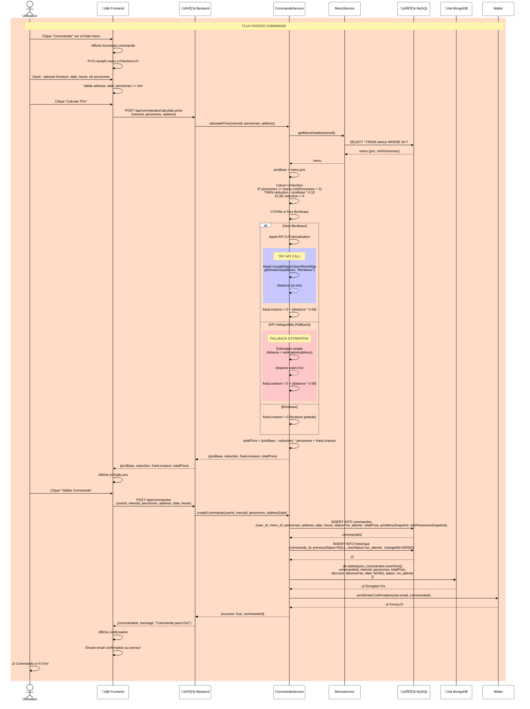

# Diagramme de Séquence 2 : Passer une Commande

## üìã Description

Flux complet de passage de commande : calcul prix, réductions, frais livraison, historisation et notification.

---

## Diagramme


```mermaid
%%{init: { 'theme': 'base', 'themeVariables': { 'primaryColor':'#ffffff', 'primaryTextColor':'#000000', 'primaryBorderColor':'#333333', 'lineColor':'#666666', 'secondBkgColor':'#f0f0f0', 'tertiaryColor':'#ffffff'} } }%%
sequenceDiagram
    actor Utilisateur
    participant Frontend as üåê Frontend
    participant Backend as 🖥️ Backend
    participant CommandeService as CommandeService
    participant MenuService as MenuService
    participant MySQL as 🗄️ MySQL
    participant MongoDB as üìä MongoDB
    participant Mailer as Mailer

    rect rgb(255, 220, 200)
    note over Utilisateur,Mailer: FLUX PASSER COMMANDE

    Utilisateur->>Frontend: Clique "Commander" sur détail menu
    Frontend->>Frontend: Affiche formulaire commande
    Frontend->>Frontend: Pré-remplit menu sélectionné

    Utilisateur->>Frontend: Saisit : adresse livraison, date, heure, nb personnes
    Frontend->>Frontend: Valide adresse, date, personnes >= min
    
    Utilisateur->>Frontend: Clique "Calculer Prix"
    Frontend->>Backend: POST /api/commandes/calculate-price<br/>(menuId, personnes, address)
    
    Backend->>CommandeService: calculatePrice(menuId, personnes, address)
    
    CommandeService->>MenuService: getMenuDetails(menuId)
    MenuService->>MySQL: SELECT * FROM menus WHERE id=?
    MySQL-->>MenuService: menu {prix, minPersonnes}
    MenuService-->>CommandeService: menu
    
    CommandeService->>CommandeService: prixBase = menu.prix
    
    CommandeService->>CommandeService: Calcul réduction<br/>IF personnes >= (menu.minPersonnes + 5)<br/>THEN reduction = prixBase * 0.10<br/>ELSE reduction = 0
    
    CommandeService->>CommandeService: Vérifie si hors Bordeaux
    
    alt Hors Bordeaux
        CommandeService->>CommandeService: Appel API Géolocalisation
        rect rgb(200, 200, 255)
        note over CommandeService: TRY API CALL
        CommandeService->>CommandeService: Appel GoogleMaps/OpenStreetMap<br/>getDistance(address, "Bordeaux")
        CommandeService-->>CommandeService: distance (en km)
        end
        
        CommandeService->>CommandeService: fraisLivraison = 5 + (distance * 0.59)
    else API Indisponible (Fallback)
        rect rgb(255, 200, 200)
        note over CommandeService: FALLBACK ESTIMATION
        CommandeService->>CommandeService: Estimation simple<br/>distance = estimation(address)
        CommandeService-->>CommandeService: distance estimée
        CommandeService->>CommandeService: fraisLivraison = 5 + (distance * 0.59)
        end
    else Bordeaux
        CommandeService->>CommandeService: fraisLivraison = 0 (livraison gratuite)
    end
    
    CommandeService->>CommandeService: totalPrice = (prixBase - reduction) * personnes + fraisLivraison
    
    CommandeService-->>Backend: {prixBase, reduction, fraisLivraison, totalPrice}
    Backend-->>Frontend: {prixBase, reduction, fraisLivraison, totalPrice}
    Frontend->>Frontend: Affiche détails prix
    
    Utilisateur->>Frontend: Clique "Valider Commande"
    Frontend->>Backend: POST /api/commandes<br/>(userId, menuId, personnes, address, date, heure)
    
    Backend->>CommandeService: createCommande(userId, menuId, personnes, addressData)
    
    CommandeService->>MySQL: INSERT INTO commandes<br/>(user_id, menu_id, personnes, address, date, heure, status='en_attente', totalPrice, prixMenuSnapshot, minPersonnesSnapshot)
    MySQL-->>CommandeService: commandeId
    
    CommandeService->>MySQL: INSERT INTO historique<br/>(commande_id, previousStatus=NULL, newStatus='en_attente', changedAt=NOW())
    MySQL-->>CommandeService: ‚úì
    
    CommandeService->>MongoDB: db.statistiques_commandes.insertOne({<br/>commandeId, menuId, personnes, totalPrice,<br/>discount, deliveryFee, date: NOW(), status: 'en_attente'<br/>})
    MongoDB-->>CommandeService: ✓ Enregistrée
    
    CommandeService->>Mailer: sendOrderConfirmation(user.email, commandeId)
    Mailer-->>CommandeService: ✓ Envoyé
    
    CommandeService-->>Backend: {success: true, commandeId}
    Backend-->>Frontend: {commandeId, message: "Commande passée!"}
    Frontend->>Frontend: Affiche confirmation
    Frontend->>Frontend: Envoie email confirmation au serveur
    Utilisateur->>Utilisateur: ✓ Commande créée!
    
    end
```

---

## 📊 Détails du Flux

### **Calcul du Prix**

| Règle | Détail |
|-------|--------|
| **Réduction 10%** | IF personnes ≥ (minPersonnes + 5) THEN réduction = prixBase × 0.10 |
| **Frais Livraison** | IF Bordeaux THEN 0€<br/>ELSE 5€ + (distance_km × 0,59€/km)<br/>distance obtenue via API Géolocalisation (Google Maps/OpenStreetMap) avec fallback sur estimation simple si API indisponible |
| **Prix Total** | (prixBase - réduction) × personnes + fraisLivraison |

### **Flux d'Exécution**

| Étape | Système | Action |
|-------|---------|--------|
| 1-3 | Frontend | Affiche formulaire + Saisie |
| 4-6 | Frontend + Backend | Validation + Calcul prix |
| 7-11 | CommandeService | Calculs réductions et frais |
| 12-13 | Frontend + Utilisateur | Affiche prix + Confirmation |
| 14-16 | CommandeService | INSERT commande + historique |
| 17-18 | CommandeService | Sync MongoDB statistiques |
| 19 | Mailer | Envoie confirmation |
| 20 | Utilisateur | Reçoit email |

---

## 💾 Données Sauvegardées

### **MySQL (COMMANDES table)**

```sql
INSERT INTO commandes (
  user_id, menu_id, personnes, 
  address, date, heure,
  status, totalPrice,
  prixMenuSnapshot, minPersonnesSnapshot
)
```

### **MongoDB (statistiques_commandes)**

```javascript
db.statistiques_commandes.insertOne({
  commandeId, menuId, personnes,
  totalPrice, discount, deliveryFee,
  date: NOW(), status: 'en_attente'
})
```

### **MySQL (HISTORIQUE table)**

```sql
INSERT INTO historique (
  commande_id, previousStatus, newStatus,
  changedAt
)
VALUES (commandeId, NULL, 'en_attente', NOW())
```

---

## 🔐 Sécurité

‚úÖ **Validation input** : adresse, date, nombre personnes  
✅ **Snapshot pricing** : prix du menu gelé pour immuabilité  
✅ **Historisation** : traçabilité complète  
‚úÖ **Dual DB** : MySQL + MongoDB pour redondance  
‚úÖ **Email confirmation** : notification utilisateur  
✅ **API Géolocalisation** : Clé API stockée en variables d'environnement (`.env`), jamais exposée côté client  
‚úÖ **Fallback robuste** : Si API indisponible ‚Üí estimation simple, commande ne bloque pas

### **Configuration API Géolocalisation**

```php
// .env (ne pas committer)
GOOGLE_MAPS_API_KEY=xxxxxx
GEOLOCATION_API_TIMEOUT=5000  // ms

// Code Backend
try {
    $distance = GeoLocationService::getDistance(
        $address, 
        'Bordeaux',
        env('GOOGLE_MAPS_API_KEY')
    );
} catch (ApiTimeoutException | ApiException $e) {
    // FALLBACK : estimation simple
    $distance = GeoLocationService::estimateDistance($address);
    $this->logger->warning("Géolocalisation API failed, using estimation", ['address' => $address]);
}
```

---

## 🔗 Classes Impliquées

- **Menu** : Récupère détails menu
- **MenuService** : Logique menu
- **Commande** : Crée/gère commande
- **CommandeService** : Logique métier commande
- **Historique** : Trace changements
- **Mailer** : Notifications
- **MySQLDatabase** : Persistance MySQL
- **MongoDBClient** : Analytics MongoDB
