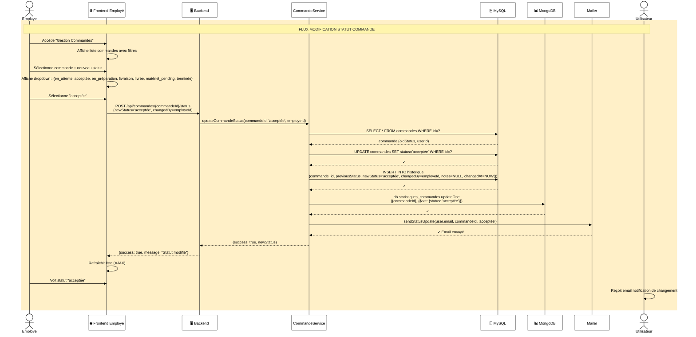

# Diagramme de Séquence 3 : Modification Statut Commande (Employé)

## 📋 Description

Flux de modification du statut d'une commande par un employé : mise à jour, historisation, synchronisation MongoDB et notification utilisateur.

---

## Diagramme



---

## 📊 Détails du Flux

### **Cycle de Vie Commande**

| Statut | Signification | Qui Modifie |
|--------|--------------|-------------|
| **en_attente** | Nouvelle commande | Système |
| **acceptée** | Validée par employé | Employé |
| **en_préparation** | En cours de préparation | Employé |
| **en_livraison** | Livrée au client | Logistique |
| **livrée** | Réceptionnée | Logistique |
| **matériel_pending** | En attente retour matériel | Système |
| **terminée** | Complètement achevée | Système |

### **Flux d'Exécution**

| Étape | Système | Action |
|-------|---------|--------|
| 1-3 | Frontend | Accès + Sélection commande |
| 4-5 | Frontend | Choix nouveau statut |
| 6-8 | Frontend + Backend | POST requête |
| 9-12 | CommandeService | UPDATE commande |
| 13 | CommandeService | INSERT historique |
| 14 | CommandeService | UPDATE MongoDB |
| 15 | Mailer | Envoie notification |
| 16 | Frontend | Rafraîchit liste |
| 17 | Employé + Utilisateur | Voir changement |

---

## 💾 Données Mises à Jour

### **MySQL (COMMANDES table)**

```sql
UPDATE commandes 
SET status = 'acceptée' 
WHERE id = {commandeId}
```

### **MySQL (HISTORIQUE table)**

```sql
INSERT INTO historique (
  commande_id, previousStatus, newStatus,
  changedBy, notes, changedAt
)
VALUES (
  {commandeId}, 'en_attente', 'acceptée',
  {employeId}, NULL, NOW()
)
```

### **MongoDB (statistiques_commandes)**

```javascript
db.statistiques_commandes.updateOne(
  { commandeId: {commandeId} },
  { $set: { status: 'acceptée' } }
)
```

---

## 📧 Notifications

| Événement | Destinataire | Email |
|-----------|--------------|-------|
| Commande acceptée | Utilisateur | "Votre commande a été acceptée" |
| En préparation | Utilisateur | "Votre commande est en préparation" |
| En livraison | Utilisateur | "Votre commande est en cours de livraison" |
| Livrée | Utilisateur | "Votre commande a été livrée" |
| Matériel pending | Utilisateur | "N'oubliez pas de retourner le matériel sous 10j" |
| Terminée | Utilisateur | "Commande terminée - Donnez votre avis" |

---

## 🔐 Sécurité

✅ **Vérification permissions** : Employé uniquement  
✅ **Traçabilité complète** : Historique + Qui + Quand  
✅ **Synchronisation DB** : MySQL + MongoDB cohérent  
✅ **Notifications** : Utilisateur informé de chaque changement  
✅ **AJAX** : Pas de rechargement page

---

## 🔗 Classes Impliquées

- **Commande** : Gère commande
- **CommandeService** : Logique métier
- **Historique** : Trace changements
- **Mailer** : Notifications
- **MySQLDatabase** : Persistance MySQL
- **MongoDBClient** : Synchronisation analytics
