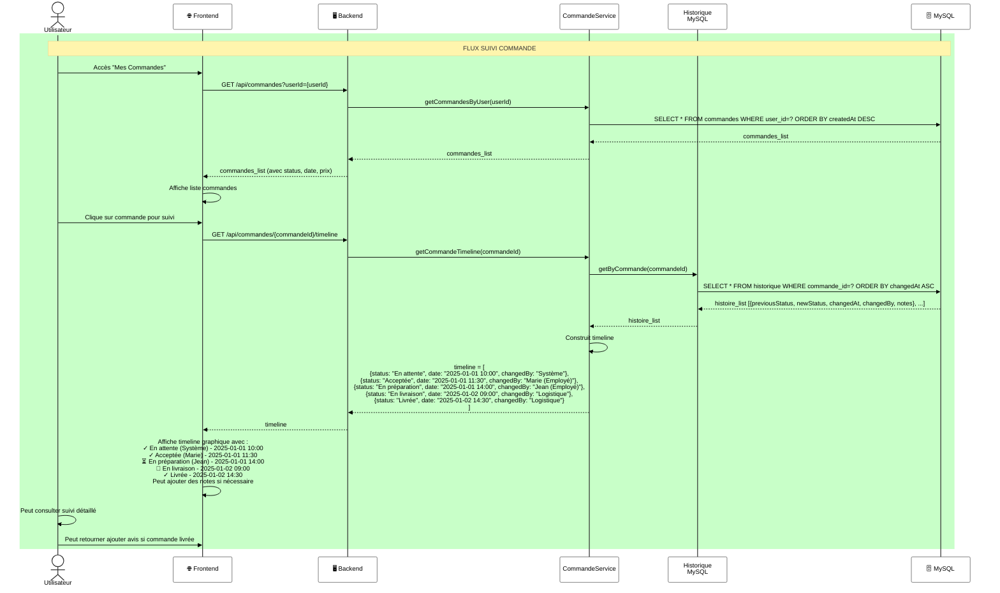

# Diagramme de Séquence 5 : Suivi de Commande (Utilisateur)

## 📋 Description

Flux de suivi d'une commande : récupération timeline avec tous les changements de statut, dates et personnes impliquées.

---

## Diagramme



---

## 📊 Détails du Flux

### **Flux d'Exécution**

| Étape | Système | Action |
|-------|---------|--------|
| 1-2 | Utilisateur + Frontend | Accès "Mes Commandes" |
| 3-4 | Frontend + Backend | GET commandes |
| 5-6 | CommandeService | Récupère commandes |
| 7-9 | Frontend | Affiche liste |
| 10 | Utilisateur | Sélectionne commande |
| 11-12 | Frontend + Backend | GET timeline |
| 13-14 | CommandeService | Récupère historique |
| 15-17 | Historique | SELECT depuis MySQL |
| 18 | CommandeService | Construit timeline |
| 19-20 | Frontend + Utilisateur | Affiche graphique |

### **Timeline Exemple**

```
✓ En attente
  Créée le 2025-01-01 10:00 (Système)
  
✓ Acceptée
  Validée le 2025-01-01 11:30 (Marie - Employé)
  
⏳ En préparation
  Depuis le 2025-01-01 14:00 (Jean - Employé)
  
🚚 En livraison
  Depuis le 2025-01-02 09:00 (Logistique)
  
✓ Livrée
  Réceptionnée le 2025-01-02 14:30 (Logistique)
```

---

## 💾 Source des Données

### **MySQL (HISTORIQUE table)**

La table `historique` enregistre chaque changement :

```sql
SELECT * FROM historique 
WHERE commande_id = ? 
ORDER BY changedAt ASC
```

Structure :

```sql
CREATE TABLE historique (
  id INT PRIMARY KEY AUTO_INCREMENT,
  commande_id INT NOT NULL,
  previousStatus VARCHAR(50),
  newStatus VARCHAR(50) NOT NULL,
  changedBy INT,           -- ID utilisateur/employé
  notes TEXT,
  changedAt TIMESTAMP DEFAULT CURRENT_TIMESTAMP,
  FOREIGN KEY (commande_id) REFERENCES commandes(id),
  FOREIGN KEY (changedBy) REFERENCES users(id)
);
```

---

## 📊 Exemple de Données

### **Commandes Récupérées**

```json
[
  {
    "id": 1,
    "menuId": 5,
    "status": "livrée",
    "createdAt": "2025-01-01 10:00",
    "totalPrice": 125.50,
    "personnes": 4
  },
  {
    "id": 2,
    "menuId": 3,
    "status": "en_attente",
    "createdAt": "2025-01-03 14:30",
    "totalPrice": 89.00,
    "personnes": 2
  }
]
```

### **Timeline pour Commande #1**

```json
[
  {
    "status": "en_attente",
    "date": "2025-01-01 10:00",
    "changedBy": "Système",
    "notes": null
  },
  {
    "status": "acceptée",
    "date": "2025-01-01 11:30",
    "changedBy": "Marie (Employé)",
    "notes": "Commande validée"
  },
  {
    "status": "en_préparation",
    "date": "2025-01-01 14:00",
    "changedBy": "Jean (Employé)",
    "notes": "Cuisine commencée"
  },
  {
    "status": "en_livraison",
    "date": "2025-01-02 09:00",
    "changedBy": "Logistique",
    "notes": "En route"
  },
  {
    "status": "livrée",
    "date": "2025-01-02 14:30",
    "changedBy": "Logistique",
    "notes": "Réceptionnée par client"
  }
]
```

---

## 🎯 Fonctionnalités

✅ **Liste commandes** : Visualiser toutes ses commandes  
✅ **Timeline graphique** : Voir progression état par état  
✅ **Dates & heures** : Trace complète du timing  
✅ **Responsable** : Qui a effectué chaque changement  
✅ **Notes** : Commentaires associés (optionnel)  
✅ **Lien avis** : "Donner avis" si commande livrée/terminée

---

## 🔐 Sécurité

✅ **Authentification** : Utilisateur connecté requis  
✅ **Autorisation** : Utilisateur voit seulement ses commandes  
✅ **Audit trail** : Historique complet non modifiable  
✅ **Traçabilité** : Qui a fait quoi quand  

---

## 🔗 Classes Impliquées

- **Commande** : Récupère commandes
- **CommandeService** : Logique métier
- **Historique** : Gère timeline
- **MySQLDatabase** : Persistance données
