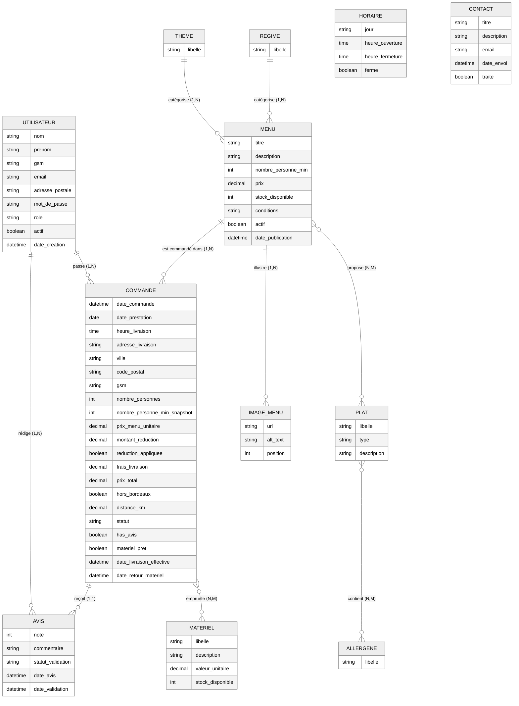

# Modèle Conceptuel de Données (MCD) - Vite & Gourmand

## Description
Ce MCD représente la logique métier pure de l'application "Vite & Gourmand", sans détails techniques de SGBD.

---

---

## Règles de Gestion Métier

### 1. Utilisateurs
- **RG01** : Un utilisateur possède un rôle unique : UTILISATEUR, EMPLOYE ou ADMINISTRATEUR
- **RG02** : Un compte peut être désactivé (actif = FALSE) mais jamais supprimé (RGPD : conservation historique)
- **RG03** : Un utilisateur CLIENT peut passer plusieurs commandes
- **RG04** : Un utilisateur CLIENT peut rédiger plusieurs avis (un par commande terminée)
- **RG05** : Un EMPLOYE ou ADMIN peut modérer les avis

### 2. Menus
- **RG06** : Un menu appartient à un seul THEME (Noël, Pâques, classique, événement)
- **RG07** : Un menu appartient à un seul REGIME (végétarien, vegan, classique)
- **RG08** : Un menu peut proposer plusieurs plats (entrées, plats, desserts)
- **RG09** : Un plat peut être présent dans plusieurs menus
- **RG10** : Un menu possède une galerie d'images (1 à N images)
- **RG11** : Un menu a un nombre minimum de personnes obligatoire
- **RG12** : Le prix du menu est pour le nombre minimum de personnes
- **RG13** : Un menu peut être désactivé (actif = FALSE) sans être supprimé

### 3. Plats & Allergènes
- **RG14** : Un plat est typé : ENTREE, PLAT ou DESSERT
- **RG15** : Un plat peut contenir plusieurs allergènes
- **RG16** : Un allergène peut être présent dans plusieurs plats

### 4. Commandes
- **RG17** : Une commande est passée par un seul utilisateur
- **RG18** : Une commande porte sur un seul menu
- **RG19** : Le nombre de personnes commandé doit être >= nombre_personne_min du menu
- **RG20** : Une réduction de 10% s'applique si nombre_personnes >= (nombre_personne_min + 5)
- **RG21** : Les frais de livraison sont de 5€ + 0,59€/km si hors Bordeaux
- **RG22** : Le prix total est calculé : (prix_menu_unitaire × nombre_personnes) - réduction + frais_livraison
- **RG23** : Une commande suit un cycle de vie à états : EN_ATTENTE → ACCEPTE → EN_PREPARATION → EN_LIVRAISON → LIVRE → EN_ATTENTE_RETOUR → TERMINEE
- **RG24** : Une commande peut être ANNULEE par le client (si statut = EN_ATTENTE)
- **RG25** : Une commande peut être ANNULEE par un employé (avec motif et contact obligatoire)
- **RG26** : Une commande peut être modifiée par le client (sauf le menu) tant que statut = EN_ATTENTE

### 5. Matériel Prêté
- **RG27** : Une commande peut emprunter plusieurs matériels
- **RG28** : Un matériel peut être prêté dans plusieurs commandes
- **RG29** : Si du matériel est prêté, le statut de la commande passe par EN_ATTENTE_RETOUR
- **RG30** : Si le matériel n'est pas restitué sous 10 jours ouvrés, frais de 600€ appliqués

### 6. Avis
- **RG31** : Un avis est rédigé pour une commande terminée
- **RG32** : Un avis porte sur le menu commandé
- **RG33** : Un avis est noté de 1 à 5 étoiles
- **RG34** : Un avis doit être validé par un employé avant affichage public
- **RG35** : Seuls les avis validés sont visibles sur la page d'accueil

### 7. Horaires & Contact
- **RG36** : Les horaires sont affichés pour chaque jour de la semaine
- **RG37** : Un jour peut être fermé (ferme = TRUE)
- **RG38** : Les messages de contact sont envoyés par email à l'entreprise

---

## Cardinalités Justifiées

| Relation | Cardinalité | Justification Métier |
|----------|-------------|----------------------|
| UTILISATEUR → COMMANDE | `1,N` | Un utilisateur peut passer plusieurs commandes |
| COMMANDE → UTILISATEUR | `1,1` | Une commande est passée par un seul utilisateur |
| MENU → COMMANDE | `1,N` | Un menu peut être commandé plusieurs fois |
| COMMANDE → MENU | `1,1` | Une commande porte sur un seul menu |
| THEME → MENU | `1,N` | Un thème catégorise plusieurs menus |
| MENU → THEME | `1,1` | Un menu a un seul thème |
| REGIME → MENU | `1,N` | Un régime catégorise plusieurs menus |
| MENU → REGIME | `1,1` | Un menu a un seul régime |
| MENU ↔ PLAT | `N,M` | Un menu propose plusieurs plats, un plat peut être dans plusieurs menus |
| PLAT ↔ ALLERGENE | `N,M` | Un plat peut contenir plusieurs allergènes, un allergène peut être dans plusieurs plats |
| COMMANDE ↔ MATERIEL | `N,M` | Une commande peut emprunter plusieurs matériels, un matériel peut être prêté plusieurs fois |
| COMMANDE → AVIS | `1,1` | Une commande terminée peut recevoir un seul avis |
| AVIS → COMMANDE | `0,1` | Un avis est lié à une commande (optionnel si commande sans avis) |
| MENU → IMAGE_MENU | `1,N` | Un menu possède une galerie d'images |
| UTILISATEUR → AVIS | `1,N` | Un utilisateur peut rédiger plusieurs avis |
| AVIS → MENU | `1,1` | Un avis porte sur un menu spécifique |

---

## Normalisation

Ce MCD respecte les règles de normalisation :

- **1NF** : Tous les attributs sont atomiques (pas de listes)
- **2NF** : Tous les attributs dépendent de la clé primaire entière
- **3NF** : Aucune dépendance transitive (THEME et REGIME sont externalisés)

---

## Différences avec le MLD/SQL

Le MCD est **conceptuel** et ignore les détails techniques :

| Aspect | MCD | MLD/SQL |
|--------|-----|---------|
| Types de données | Abstrait (string, int, decimal) | Précis (VARCHAR(100), INT, DECIMAL(10,2)) |
| Clés primaires | Implicites | Explicites (id_utilisateur PK) |
| Clés étrangères | Implicites dans relations | Explicites (FK avec ON DELETE/UPDATE) |
| Contraintes SQL | Absentes | CHECK, NOT NULL, DEFAULT, UNIQUE |
| Tables de traçabilité | Absentes | COMMANDE_STATUT, COMMANDE_ANNULATION, COMMANDE_MODIFICATION |
| Tables techniques | Absentes | RESET_TOKEN, AVIS_FALLBACK |
| Indexes | Absents | INDEX sur FK et colonnes recherchées |
| Triggers | Absents | Triggers pour historisation automatique |
| Vues | Absentes | Vues pour requêtes courantes |

---

## Architecture Hybride MySQL + MongoDB

Le MCD représente la logique métier pure. L'implémentation technique utilise :

- **MySQL** : Tables relationnelles (utilisateurs, menus, commandes, plats)
- **MongoDB** : Collections NoSQL (avis, statistiques_commandes)
- **Synchronisation** : AVIS_FALLBACK (MySQL) ↔ avis (MongoDB)

Cette architecture hybride répond aux exigences de l'énoncé :
> "Les données doivent venir d'une base de données non relationnelle" (statistiques admin)

---

## Évolutions Possibles

Améliorations métier envisageables :

1. **Notifications** : Entité NOTIFICATION pour gérer les emails (bienvenue, confirmation commande, retour matériel)
2. **Facturation** : Entité FACTURE pour éditer les factures PDF
3. **Programme fidélité** : Entité CARTE_FIDELITE avec points cumulés
4. **Zones de livraison** : Entité ZONE_LIVRAISON avec tarifs personnalisés par zone géographique
5. **Planification** : Entité PLANNING pour gérer la disponibilité de l'équipe cuisine/livraison

---

**Auteur** : Max  
**Date** : 11 décembre 2025  
**Projet** : Vite & Gourmand - ECF Développeur Web et Web Mobile  
**Version** : 1.0
